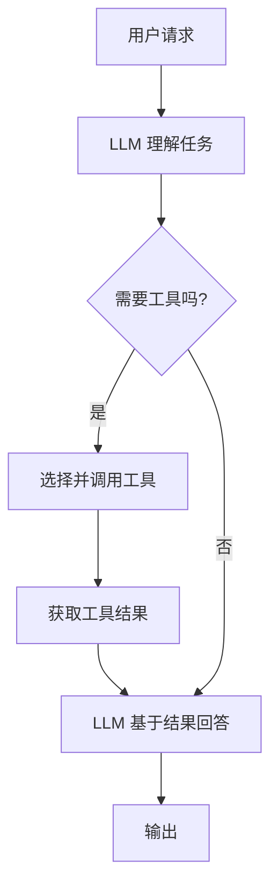

# 一、工具使用与调用

工具是 Agent 的「手脚」，让 Agent 能够与外部世界交互！

## 1. 工具类型

### 1.1 常见工具分类

| 类型 | 例子 | 用途 |
|------|------|------|
| **信息检索** | 搜索引擎、数据库查询 | 获取外部知识 |
| **数据处理** | 文件读写、CSV 解析 | 处理数据 |
| **API 调用** | 天气、邮件、支付 | 与服务交互 |
| **代码执行** | Python 解释器 | 执行代码、计算 |

### 1.2 在项目中的应用

本项目中，Trae IDE 的内置命令和 Agent 功能，本质就是工具！

## 2. 工具设计原则

1. **单一职责**：每个工具只做一件事
2. **清晰的输入输出**：明确的参数和返回值
3. **错误处理**：工具失败时给出明确反馈
4. **安全性**：避免执行危险操作

## 3. 工具调用流程

## 4. 最佳实践

- **工具描述要详细**：帮助 LLM 理解何时使用
- **限制工具数量**：避免选择困难
- **验证工具输出**：防止错误结果影响回答
- **工具编排**：多个工具按顺序调用

## 5. 总结

工具让 Agent 从「只能说话」变成「能够做事」！

::: tip 下一步
接下来学习 [规划与推理能力](./04-规划与推理能力.md)！
:::
